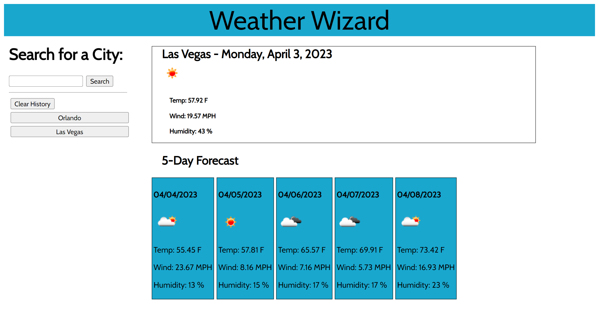

# weather-dashboard
Weather Dashboard application using OpenWeatherMap API.

## Description

This is a web application that allows a user to see current weather conditions as well as a five-day forecast for a specific city.  It utilizes the OpenWeatherMap API to get weather data and display to the user.  

## Usage

The user can type the name of a city in the search box and after clicking the search button current weather along with a five-day forecast for that city will display.  One the left side a search history is maintained and the user can easily click those buttons to search for a previously searched city.  The history list can be cleard by clicking the Clear button.

## Application link:

https://gmgabrie.github.io/weather-dashboard/

## Features

- Dynamically updating date and time using DayJS API.
- Saving/retreiving of data to/from local storage.
- Dynamic display of weather conditions and five day forecast information.
- Use of server-side API OpenWeatherMap to retrieve city information/weather.